<div align="center">


# Zyocra

**Verifiable LoRA risk oracle for DeFi**

Benchmark compiler-generated EZKL against hand-optimized Circom on matched LoRA head workloads, with on-chain verification and collateral policy updates.

<br />

[](https://sepolia.etherscan.io/)
[](docs/ezkl.md)
[](docs/circom.md)
[](https://zyocra.vercel.app/)
[](https://github.com/vamshiganesh/Zyocra/actions/workflows/ci.yml)

<br />

**[Project homepage](https://vamshiganesh.github.io/Zyocra/)** ·
**[Live app](https://zyocra.vercel.app/)** ·
**[Watch demo](https://youtu.be/edvTJN3XJO0)** ·
**[Circom submitScore tx](https://sepolia.etherscan.io/tx/0x6229ebe4151ddef5490766e8ea95b7280b6b4e252ccbbed3c1b0bde01c8da09b)** ·
**[Wallet apply tx](https://sepolia.etherscan.io/tx/0x97829cb73ef3876e536eb26400b9f1449c5793b8f0c9febfbc4a0574eaa39962)** ·
**[Source](https://github.com/vamshiganesh/Zyocra)**

<br />

<sub>GitHub README links open in the same tab. Use <a href="https://vamshiganesh.github.io/Zyocra/">Project homepage</a> for external links in a new tab.</sub>

</div>

---

## Table of contents

1. [Zyocra in one paragraph](#1-zyocra-in-one-paragraph)
2. [Why it matters](#2-why-it-matters)
3. [Architecture](#3-architecture)
4. [Demo flow](#4-demo-flow)
5. [The benchmark question](#5-the-benchmark-question)
6. [Screenshots / UI](#6-screenshots--ui)
7. [Benchmark headline table](#7-benchmark-headline-table)
8. [Contracts overview](#8-contracts-overview)
9. [ML, quantization, and EZKL flow](#9-ml-quantization-and-ezkl-flow)
10. [Custom Circom benchmark path](#10-custom-circom-benchmark-path)
11. [Threat model](#11-threat-model)
12. [Local setup](#12-local-setup)
13. [Project structure](#13-project-structure)
14. [Roadmap](#14-roadmap)
15. [Resume-ready bullet](#15-resume-ready-bullet)
16. [Demo instructions](#16-demo-instructions)

<br />

<div align="center">

<a href="https://vamshiganesh.github.io/Zyocra/">
  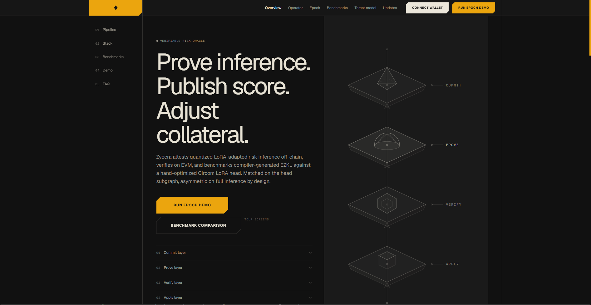
</a>

<br /><br />

<sub>Click thumbnail for the project homepage (live links, Sepolia txs, stack summary).</sub>

</div>

---

## 1. Zyocra in one paragraph

Zyocra is a **benchmark-driven zkML risk oracle** for DeFi lending demos. It trains a small quantized tabular MLP with LoRA adapters (\(W' = W + AB\)), exports ONNX, and proves inference on two paths: **EZKL** (compiler-generated Halo2 verifier) and **hand-written Circom** (Groth16 on the LoRA output head). Verified scores land on `RiskOracle`; `RiskConsumer` maps risk buckets to collateral factor and borrow spread without triggering liquidation. The repo ships a reproducible benchmark harness (`make head-benchmark`), Foundry integration tests, an Operator FastAPI service, a Vite UI with live Sepolia reads, and **live Sepolia deployments** with wallet-signed `submitScore` / `applyVerifiedScore`. Default workflow is **local-first on Ubuntu WSL**: PyTorch CPU, EZKL, Circom, Foundry, Anvil. No paid RPC or cloud prover required unless you opt in.

---

## 2. Why it matters

DeFi protocols increasingly need **verifiable risk signals**, not opaque off-chain scores. zkML toolchains like EZKL make full-graph attestation practical, but compiler output can hide cost in structured algebra (especially low-rank updates). Zyocra asks a concrete engineering question:

> **When the proof statement is held constant on the LoRA output head, how much efficiency does a hand-optimized Circom circuit buy versus an EZKL-compiled head ONNX graph?**

That question matters to:

| Audience | What Zyocra demonstrates |
|----------|--------------------------|
| **zk infra recruiters** | End-to-end prove, verify, deploy, benchmark, and UI wiring across two proof systems |
| **Smart contract engineers** | Oracle admission, score binding, ACL on provers and applicators, consumer policy updates |
| **Applied cryptography teams** | Quantization error budgets, public input layout, Groth16 vs Halo2 verifier gas |
| **zkML researchers** | Fair head-to-head vs labeled asymmetric full-graph workload, hybrid amortization model |
| **Hackathon judges** | Live Sepolia txs, reproducible metrics, threat model with explicit non-guarantees |

Zyocra is **not** a production lending protocol. It is a serious reference implementation for comparing zkML approaches on a real DeFi-shaped oracle loop.

---

## 3. Architecture

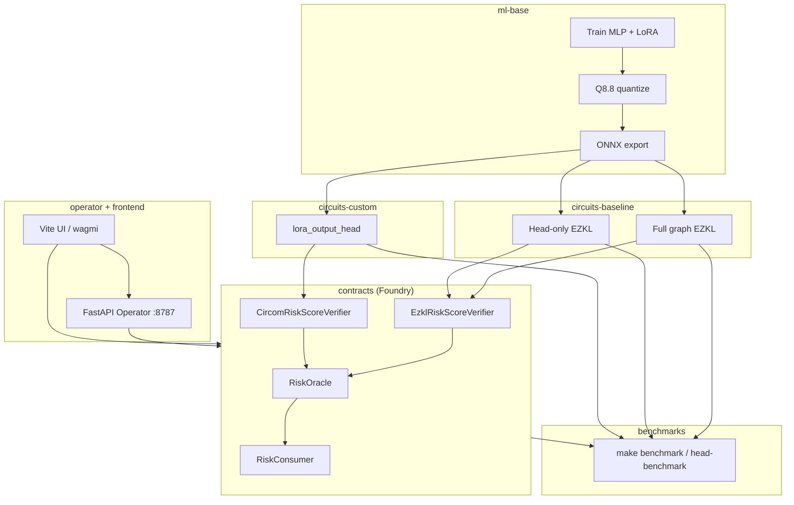

**Layer map**

| Package | Role |
|---------|------|
| `ml-base/` | Tabular MLP, LoRA, Q8.8 quantization, ONNX, float reference eval |
| `circuits-baseline/` | EZKL full graph + head-only ONNX compile, Halo2 verifier |
| `circuits-custom/` | Circom `lora_output_head`, Groth16 verifier, fixtures |
| `contracts/` | `RiskOracle`, `RiskConsumer`, verifier adapters, Foundry tests |
| `benchmarks/` | Normalized JSON/CSV/MD, plots, gas harness |
| `operator/` | Job queue for e2e, deploy, submit, benchmark (SSE logs) |
| `frontend/` | Pipeline UI, Operator dashboard, live chain reads |

Details: [`docs/architecture.md`](docs/architecture.md)

---

## 4. Demo flow

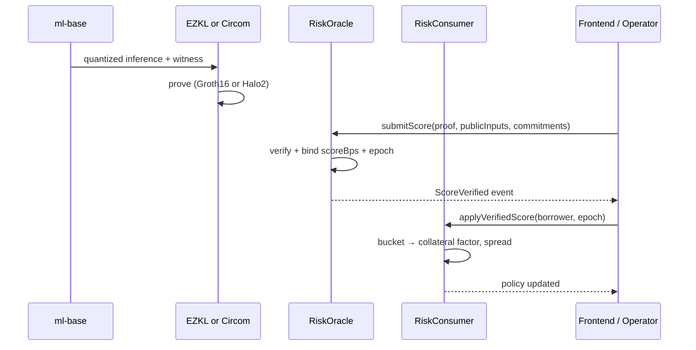

**Operator paths**

| Mode | What runs |
|------|-----------|
| **Anvil (default)** | Full epoch loop via `e2e_phase1.sh` or `e2e_circom.sh` |
| **Sepolia (Operator toggle)** | Forge deploy/submit with deployer key |
| **Sepolia (wallet)** | MetaMask signs `submitScore` + `applyVerifiedScore` |

Live app: [zyocra.vercel.app](https://zyocra.vercel.app/) · Demo video: [YouTube](https://youtu.be/edvTJN3XJO0)

---

## 5. The benchmark question

**Read this in 30 seconds:**

1. **Fair comparison:** EZKL head-only ONNX vs Circom `lora_output_head` on the same `hidden[8] → logit_acc` statement (`make head-benchmark`, `PROVE_RUNS=10`).
2. **Asymmetric system row:** EZKL full graph (6→16→8→1 + sigmoid) vs Circom head. Different workloads. Not a kernel bakeoff.
3. **Hybrid model:** One EZKL full prove per epoch + Circom head proves per adapter update (default 4 updates). Amortized prove cost ≈ **10.4 s/update** on the latest local run.

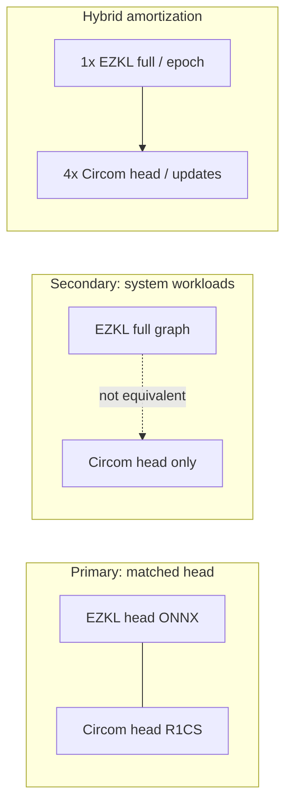

Methodology and limitations: [`docs/benchmarks.md`](docs/benchmarks.md) · Raw artifact: `frontend/public/data/bench-latest.json` (synced from `benchmarks/raw-results/`)

---

## 6. Screenshots / UI

Dispatch-inspired shell (dark canvas, cream panels, amber accent). Live data from `phase1-demo.json` and `bench-latest.json`.

### Landing and pipeline

<table>
  <tr>
    <td align="center" width="50%">
      <strong>Overview</strong><br />
      <sub>Hero, pipeline strip, live demo snapshot, benchmark panel</sub><br /><br />
      <a href="https://zyocra.vercel.app/">
        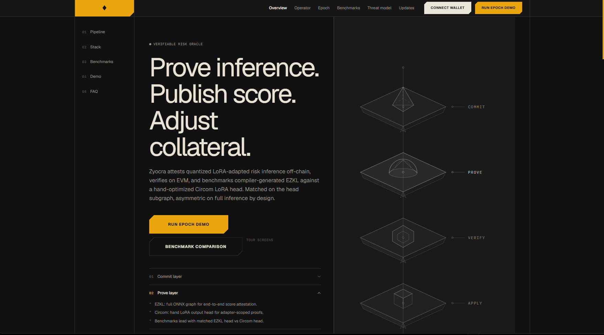
      </a>
    </td>
    <td align="center" width="50%">
      <strong>Operator</strong><br />
      <sub>Job queue, Anvil/Sepolia toggle, wallet submit, on-chain tx log</sub><br /><br />
      <a href="https://zyocra.vercel.app/operator">
        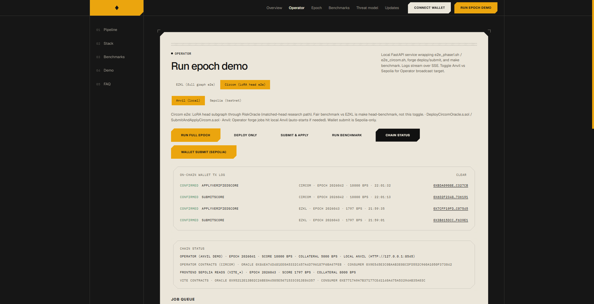
      </a>
    </td>
  </tr>
  <tr>
    <td align="center" width="50%">
      <strong>Epoch explorer</strong><br />
      <sub>Commitments, inputs, prove/verify/score/impact screens</sub><br /><br />
      <a href="https://zyocra.vercel.app/epoch">
        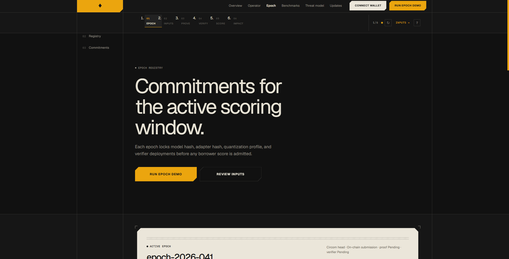
      </a>
    </td>
    <td align="center" width="50%">
      <strong>Benchmarks</strong><br />
      <sub>Matched head table, asymmetric system row, hybrid amortization</sub><br /><br />
      <a href="https://zyocra.vercel.app/benchmarks">
        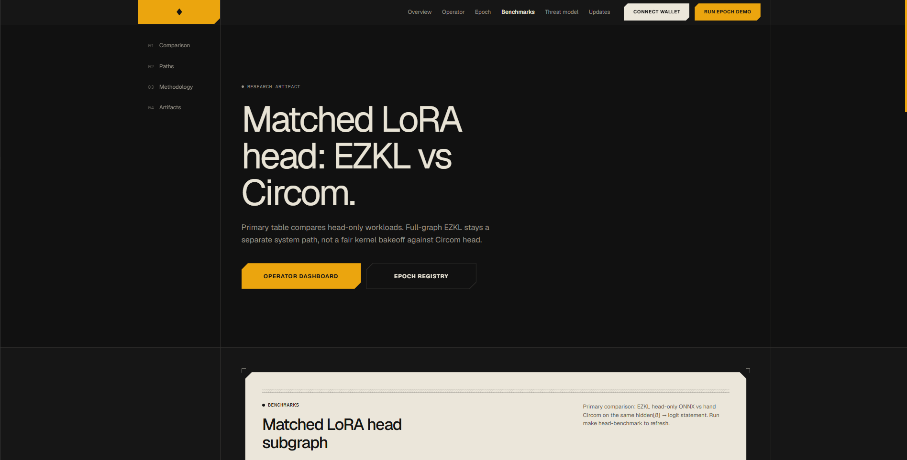
      </a>
    </td>
  </tr>
  <tr>
    <td align="center" width="50%">
      <strong>Threat model</strong><br />
      <sub>Guarantees vs non-guarantees for reviewers</sub><br /><br />
      <a href="https://zyocra.vercel.app/threat-model">
        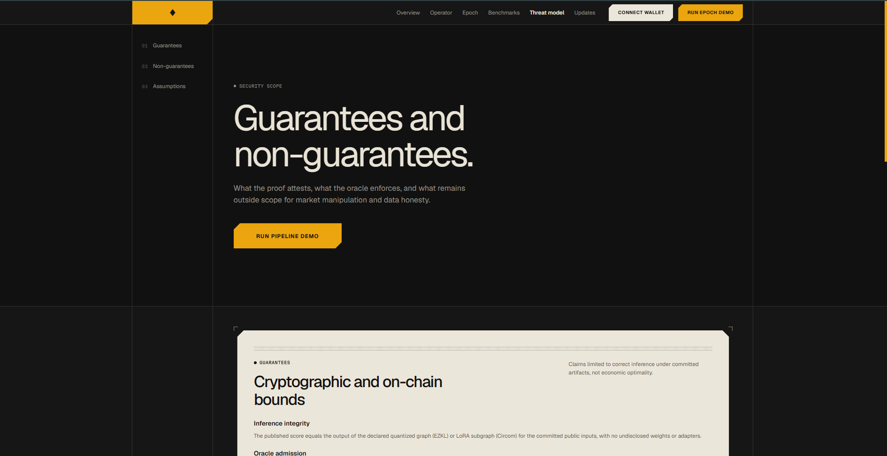
      </a>
    </td>
    <td align="center" width="50%">
      <strong>Updates</strong><br />
      <sub>Changelog and release notes</sub><br /><br />
      <a href="https://zyocra.vercel.app/updates">
        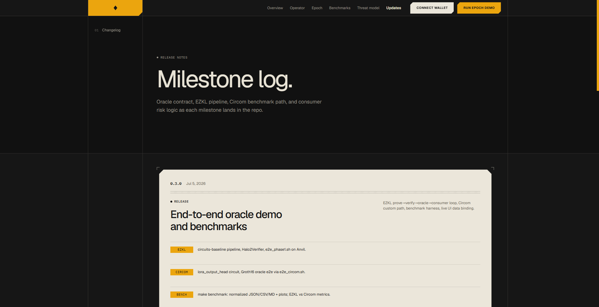
      </a>
    </td>
  </tr>
</table>

---

## 7. Benchmark headline table

*Source: `bench-latest.json` · UTC 2026-07-08 · median of 10 prove runs · Linux WSL2*

### Primary: fair circuit comparison (matched LoRA head)

| Metric | EZKL head | Circom head | Notes |
|--------|-----------|-------------|-------|
| Constraint count | **106** PLONK rows | **90** R1CS | Different proof systems |
| Prover peak RAM | **~1.39 GB** | **~186 MB** | Linux `time -v` peak RSS |
| Proof time (median) | **28.2 s** | **1.9 s** | `PROVE_RUNS=10` |
| Proof size | **~18.2 KB** | **805 B** | Serialized proof bytes |
| Standalone verify gas | n/a (head row) | **251,231** | `BenchmarkGas.t.sol` |

```bash
make head-benchmark
bash scripts/sync-frontend-data.sh   # optional: refresh UI JSON
```

### Secondary: system workloads (not equivalent)

| Metric | EZKL full graph | Circom head |
|--------|-----------------|-------------|
| Constraint count | 964 PLONK rows | 90 R1CS |
| Prover peak RAM | ~1.68 GB | ~186 MB |
| Proof time (median) | 34.0 s | 1.9 s |
| Standalone verify gas | **536,176** | **251,231** |
| Proof size | ~21.5 KB | 805 B |

**Do not** treat the secondary row as a fair race. Full-graph EZKL attests features→score; Circom attests head-only `logit_acc`.

### Hybrid amortized cost

| Input | Value |
|-------|-------|
| EZKL full prove / epoch | 34.0 s |
| Circom head prove / update | 1.9 s |
| Updates per epoch (default) | 4 |
| **Amortized prove / update** | **~10.4 s** |

Quantization accuracy (EZKL full, test split): mean abs error **0.00137**, max abs error **0.00641** on score field.

---

## 8. Contracts overview

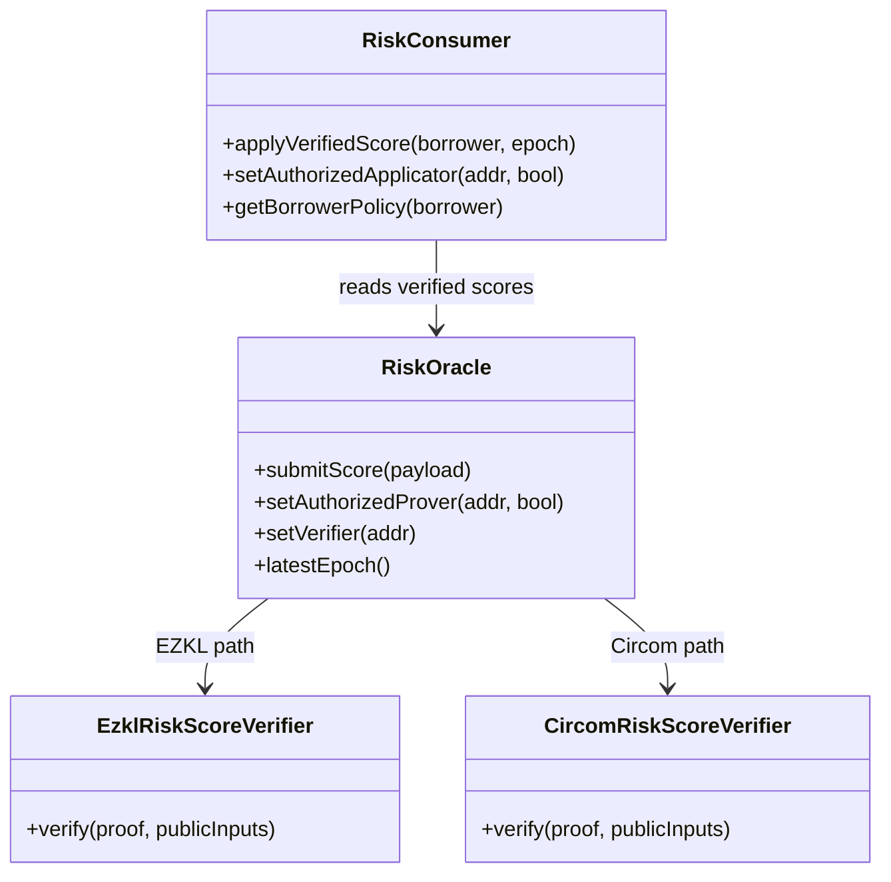

| Contract | Responsibility |
|----------|----------------|
| `RiskOracle` | Commitments, epoch monotonicity, proof verification, `ScoreVerified` |
| `RiskConsumer` | Bucket → collateral factor, borrow spread, borrow gate |
| `EzklRiskScoreVerifier` | Halo2 adapter for EZKL proofs |
| `CircomRiskScoreVerifier` | Groth16 adapter for Circom head (10 public signals) |

**Sepolia EZKL stack (latest)**

| Contract | Address |
|----------|---------|
| RiskOracle | [`0x95212e13B02C26bE0A4505e5671533C013e04357`](https://sepolia.etherscan.io/address/0x95212e13B02C26bE0A4505e5671533C013e04357) |
| RiskConsumer | [`0xE7717a9a7b37177ce41140A475a53294Ab35a03c`](https://sepolia.etherscan.io/address/0xE7717a9a7b37177ce41140A475a53294Ab35a03c) |

**Sepolia Circom stack (latest)**

| Contract | Address |
|----------|---------|
| RiskOracle | [`0xdc5E502DC59a4d65e18E5F045711401710f309f1`](https://sepolia.etherscan.io/address/0xdc5E502DC59a4d65e18E5F045711401710f309f1) |
| RiskConsumer | [`0x0E64bB23Af32307F1228e1379d77Bc7AD2739359`](https://sepolia.etherscan.io/address/0x0E648B23AF32307F1228E1379D77BC7AD2739359) |

**Live transactions (demo)**

| Step | Tx |
|------|-----|
| Circom `submitScore` | [`0x6229ebe4…a09b`](https://sepolia.etherscan.io/tx/0x6229ebe4151ddef5490766e8ea95b7280b6b4e252ccbbed3c1b0bde01c8da09b) |
| Wallet `applyVerifiedScore` | [`0x97829cb7…9962`](https://sepolia.etherscan.io/tx/0x97829cb73ef3876e536eb26400b9f1449c5793b8f0c9febfbc4a0574eaa39962) |

Contract docs: [`docs/contracts.md`](docs/contracts.md)

---

## 9. ML, quantization, and EZKL flow

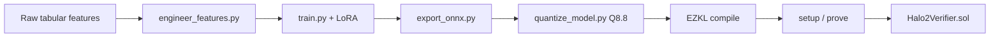

| Stage | Output |
|-------|--------|
| Training | `ml-base/artifacts/models/` (gitignored locally) |
| ONNX | `zyocra-risk-mlp-v1.onnx` static batch=1 |
| Quantization | `input_scale=7`, `param_scale=7` (Q8.8 alignment) |
| EZKL | `circuits-baseline/settings/network.ezkl`, `proofs/proof.json` |
| On-chain | `submitScore` with 7 EZKL public inputs + borrower limb (index 7) |

EZKL proves the **full exported graph**. Public inputs bind features and `scoreBps`. Borrower binding for EZKL uses an appended limb (Circom binds borrower in-circuit).

Docs: [`docs/ml.md`](docs/ml.md) · [`docs/quantization.md`](docs/quantization.md) · [`docs/ezkl.md`](docs/ezkl.md)

---

## 10. Custom Circom benchmark path

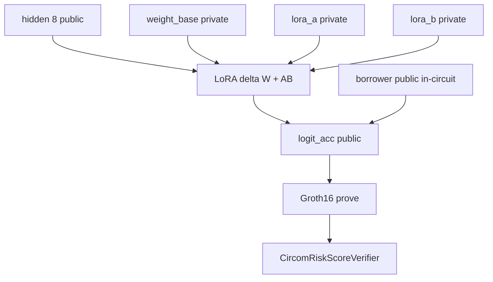

| Property | Value |
|----------|-------|
| Circuit | `circuits-custom/circuits/lora_output_head.circom` |
| Public signals | 10 (`logit_acc`, `hidden[8]`, `borrower`) |
| R1CS constraints | 90 (snarkjs) |
| Fixture | `circuits-custom/fixtures/head-v1.json` (committed) |
| Trusted setup | Local pot12 (demo only, not production-grade) |

Circom score on-chain uses cubic Taylor sigmoid over dequantized `logit_acc` (Python and Solidity aligned). Scope is **adapter head only**, not full MLP inference.

Docs: [`docs/circom.md`](docs/circom.md)

---

## 11. Threat model

Zyocra separates **proof correctness** from **model quality** and **data honesty**.

| Layer | What is trusted |
|-------|-----------------|
| **Proof** | Declared inference ran as specified (EZKL: full graph; Circom: head subgraph) |
| **Oracle** | Verifier soundness, `modelHash` / `adapterHash`, monotonic epochs, valid `(proof, publicInputs)` |
| **Consumer** | Verified oracle scores; hard-coded bucket policy |

**Not attested:** feature feed honesty, economic optimality of the model, market manipulation resistance, cross-path benchmark equivalence (EZKL full vs Circom head).

**Phase 1 gaps (documented):** EZKL borrower uses appended public limb; `setVerifier` is owner-controlled without timelock; Circom trusted setup is local pot12.

Full write-up: [`docs/threat-model.md`](docs/threat-model.md)

---

## 12. Local setup

**Prerequisites:** Node.js + pnpm, Python 3.11+, Rust, Foundry, Circom (for custom path). Ubuntu WSL is the reference environment.

```bash
git clone https://github.com/vamshiganesh/Zyocra.git
cd Zyocra
make install
source ml-base/.venv/bin/activate

make check-tools
make test          # forge + pytest + frontend tsc
make benchmark     # full benchmark harness
make head-benchmark   # matched head row only

cp .env.example .env
make dev           # Operator :8787 + Vite :5173
```

| Property | Default |
|----------|---------|
| ML runtime | PyTorch CPU in `ml-base/.venv` |
| Chain (dev) | Anvil via Operator |
| Chain (demo) | Sepolia (optional, free public RPC) |
| Docker | Not required |
| Cloud prover | Not required |

Full toolchain: [`docs/setup.md`](docs/setup.md)

---

## 13. Project structure

```text
Zyocra/
├── ml-base/                 # train, LoRA, quantize, ONNX export
├── circuits-baseline/       # EZKL full + head pipelines
├── circuits-custom/         # Circom lora_output_head + Groth16
├── contracts/               # RiskOracle, RiskConsumer, verifiers, tests
├── benchmarks/              # harness, raw-results, plots
├── operator/                # FastAPI job runner (SSE logs)
├── frontend/                # Vite + React pipeline UI
├── scripts/                 # e2e, testnet deploy/submit, sync-frontend-data
├── docs/                    # architecture, threat model, benchmarks, setup
├── gitAssets/               # README branding + UI screenshots
├── Makefile
└── README.md
```

---

## 14. Roadmap

| Milestone | Status |
|-----------|--------|
| 1. ML + quantization (`ml-base/`) | Done |
| 2. EZKL baseline + Halo2 verifier | Done |
| 3. Custom Circom LoRA head | Done |
| 4. Consumer integration + Foundry tests | Done |
| 5. Benchmarks + technical report | Done |
| Operator + live UI + Sepolia deploy | Done |
| CI (Foundry, pytest, tsc, Circom smoke) | Done |

Future (non-blocking): production trusted setup, timelocked verifier upgrades, additional borrower binding modes.

Details: [`docs/roadmap.md`](docs/roadmap.md)

---

## 15. Resume-ready bullet

> Built **Zyocra**, a verifiable zkML DeFi risk oracle that proves LoRA-adapted quantized inference off-chain and verifies scores on Ethereum (Sepolia). Benchmarked **EZKL-compiled** circuits against a **hand-optimized Circom** LoRA head on a matched `hidden→logit` statement across constraint count, prove time, RAM, proof size, and EVM verify gas (~**14x** faster median prove for Circom head vs EZKL head on local WSL2). Shipped Foundry oracle/consumer contracts with ACL, FastAPI Operator, wallet-signed testnet txs, and a live Vite dashboard.

---

## 16. Demo instructions

### A. Fast path (UI only, ~2 min)

1. Open **[zyocra.vercel.app](https://zyocra.vercel.app/)**
2. Click **Run epoch demo** or go to **Operator**
3. Toggle **Circom** or **EZKL**, run **Chain status**
4. On Sepolia: connect wallet, **Wallet submit (Sepolia)** for live txs

### B. Local full loop (~15 to 45 min first run)

```bash
make install && source ml-base/.venv/bin/activate
bash scripts/e2e_phase1.sh      # EZKL → Anvil → oracle → consumer
# or
bash scripts/e2e_circom.sh      # Circom head path
bash scripts/sync-frontend-data.sh
make dev
```

### C. Sepolia (live chain)

```bash
cp .env.example .env
# SEPOLIA_RPC_URL, DEPLOYER_PRIVATE_KEY, ETHERSCAN_API_KEY

bash scripts/deploy_testnet.sh           # EZKL stack
bash scripts/submit_testnet.sh           # submitScore + applyVerifiedScore

SKIP_PROVE=1 bash scripts/deploy_circom_testnet.sh
SKIP_PROVE=1 bash scripts/submit_circom_testnet.sh
```

Set `VITE_ORACLE_ADDRESS`, `VITE_CONSUMER_ADDRESS`, `VITE_RPC_URL` in `.env` for the stack you want the UI to read. EZKL and Circom use **different** oracle addresses.

### D. What to show reviewers

| Asset | Link |
|-------|------|
| Live app | [zyocra.vercel.app](https://zyocra.vercel.app/) |
| Video walkthrough | [YouTube demo](https://youtu.be/edvTJN3XJO0) |
| Project homepage | [vamshiganesh.github.io/Zyocra](https://vamshiganesh.github.io/Zyocra/) |
| Circom on-chain proof | [submitScore tx](https://sepolia.etherscan.io/tx/0x6229ebe4151ddef5490766e8ea95b7280b6b4e252ccbbed3c1b0bde01c8da09b) |
| Wallet policy apply | [applyVerifiedScore tx](https://sepolia.etherscan.io/tx/0x97829cb73ef3876e536eb26400b9f1449c5793b8f0c9febfbc4a0574eaa39962) |
| Benchmark JSON | `frontend/public/data/bench-latest.json` |
| Threat model | [`docs/threat-model.md`](docs/threat-model.md) |

---

<div align="center">

<br />

**Documentation**

[`docs/product.md`](docs/product.md) ·
[`docs/architecture.md`](docs/architecture.md) ·
[`docs/benchmarks.md`](docs/benchmarks.md) ·
[`docs/threat-model.md`](docs/threat-model.md) ·
[`docs/setup.md`](docs/setup.md) ·
[`docs/technical-report.md`](docs/technical-report.md)

<br />

MIT License · [`LICENSE`](LICENSE)

</div>
